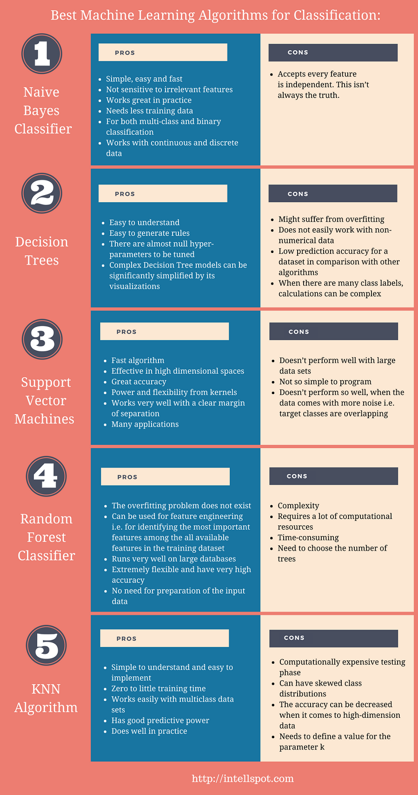

# Its_all_about_machine_learning

#### Please star the Repo, 😊🙏

### List of Algorithms:
- K-Means Clustering
- LinearRegressor
- Neural Networks
- Random Forest
- Neural Networks
- Naive Baiyes
- Support Vector machines
-

### List of Pre-Processing Algorithms
TODO:

## ML Algos

## ML cheatsheet

